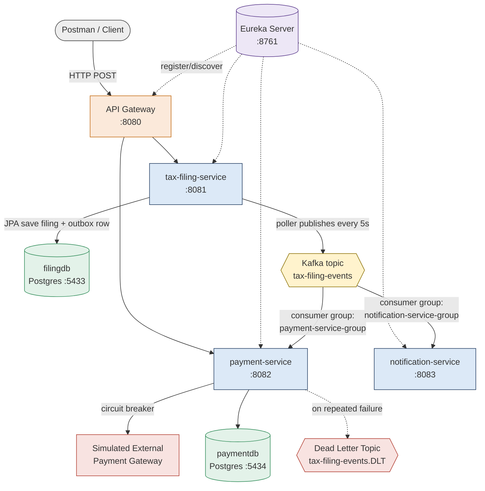

<div align="center">

# UITax — Unemployment Insurance Tax Microservices Platform

**A 5-service, event-driven Java microservices system** demonstrating service discovery, API gateway routing, the transactional outbox pattern, Kafka-based messaging, idempotent processing, circuit breakers, and dead-letter handling.

[](.)
[](.)
[](.)
[](.)
[](.)
[](.)
[](.)

📄 [**Full technical documentation (PDF)**](./docs/UITax-Project-Documentation.pdf) — architecture, database schema, every configuration file, and a complete log of real issues encountered and resolved during development.

</div>

---

## Overview

UITax simulates a simplified state unemployment insurance tax filing and payment workflow — an employer submits a filing, the system reliably records it, and independent downstream services react to that event to process payment and send notifications. It was built as a hands-on project to gain **production-grade experience with distributed systems patterns** that are difficult to learn from documentation alone: reliable event delivery, service-to-service resilience, and horizontal decoupling via message-driven architecture.

Every pattern below was not just implemented, but **deliberately broken and re-verified** — including a real Spring AOP self-invocation bug that silently disabled a circuit breaker, diagnosed and fixed through direct observation of Actuator metrics and event logs.

## Architecture



## Engineering Highlights

- **Solved the dual-write problem** using the transactional outbox pattern — filing data and its corresponding event are written atomically in a single database transaction, with a scheduled poller independently guaranteeing at-least-once delivery to Kafka.
- **Implemented idempotent event consumption**, closing a real race-condition gap in a naive "check-then-insert" approach by relying on a database uniqueness constraint as the atomic safety net rather than application-level logic.
- **Diagnosed and fixed a Spring AOP self-invocation bug** that silently disabled a `@CircuitBreaker` annotation — refactored the affected call into a dedicated Spring bean so it correctly passes through the framework's proxy, then verified the full CLOSED → OPEN → HALF_OPEN state cycle via Actuator metrics.
- **Built a Dead Letter Topic recovery path** so that messages exhausting all retries are preserved for investigation instead of being silently discarded — verified with a forced-failure test.
- **Resolved a real Spring Cloud / Spring Boot version incompatibility** across services running different framework versions, correctly pairing each service's release train.
- **Implemented service discovery and gateway-based routing** end-to-end with Netflix Eureka and Spring Cloud Gateway, including diagnosing and fixing an environment-specific hostname resolution bug on Windows.

*(Full write-up of these and 15 total real issues, with root cause and fix for each, is in the [project documentation](./docs/UITax-Project-Documentation.pdf).)*

## Services

| Service | Port | Responsibility |
|---|---|---|
| `eureka-server` | 8761 | Service registry and discovery |
| `api-gateway` | 8080 | Single entry point; routes requests to services by name via Eureka |
| `tax-filing-service` | 8081 | Accepts filings; persists via the transactional outbox pattern; publishes domain events to Kafka |
| `payment-service` | 8082 | Consumes filing events; processes payment idempotently; circuit-breaker-protected; backed by a Dead Letter Topic |
| `notification-service` | 8083 | Independently consumes the same events under a separate consumer group and logs them |

## Key Patterns Demonstrated

| Pattern | Purpose |
|---|---|
| Database-per-service | Each service owns its own PostgreSQL instance; no cross-service queries or shared schemas |
| Transactional Outbox | Guarantees reliable event publication without a distributed transaction |
| Kafka pub/sub, multiple consumer groups | Independent, decoupled reactions to the same domain event |
| Idempotent processing | Safe against Kafka's at-least-once delivery semantics |
| Circuit Breaker (Resilience4j) | Fails fast against a degraded dependency instead of cascading failure |
| Dead Letter Topic | No message is ever silently lost after exhausting retries |
| Service Discovery + API Gateway | No hardcoded service addresses; single client-facing entry point |

## Tech Stack

**Language & Framework:** Java 25 · Spring Boot 3.5 / 4.1 · Spring Cloud (Netflix Eureka, Gateway)
**Messaging & Data:** Apache Kafka · Zookeeper · PostgreSQL 16 · Spring Data JPA / Hibernate
**Resilience:** Resilience4j · Spring Kafka `DefaultErrorHandler` + `DeadLetterPublishingRecoverer`
**Infrastructure:** Docker Compose · Kafka UI
**Tooling:** Maven · Postman · DBeaver

## Quick Start

```bash
# 1. Start shared infrastructure — Postgres x2, Kafka, Zookeeper, Kafka UI
cd infra
docker compose up -d

# 2. Start each service, in order (from each service's own directory)
mvn spring-boot:run
```

**Start order matters:** `eureka-server` → `tax-filing-service` → `payment-service` → `notification-service` → `api-gateway`.

**Verify:**
- Eureka dashboard: `http://localhost:8761` — all 5 services should show `UP`
- Kafka UI: `http://localhost:8090`

**Submit a test filing through the gateway:**
```bash
curl -X POST http://localhost:8080/tax-filing-service/api/filings \
  -H "Content-Type: application/json" \
  -d '{
        "employerId": "3f7b1a2e-4c5d-4e6f-8a9b-1c2d3e4f5a6b",
        "filingPeriod": "2026-Q3",
        "wagesReported": 60000.00,
        "taxDue": 5200.00
      }'
```

Watch the `payment-service` and `notification-service` logs — both independently process the same event within a few seconds.

## Roadmap

- [ ] Automated test suite (JUnit, Mockito, Testcontainers)
- [ ] Global exception handling (`@RestControllerAdvice`)
- [ ] Containerize the application services (Dockerfile per service)
- [ ] CI/CD pipeline (Jenkins) — build, test, image publish
- [ ] Deploy to Kubernetes
- [ ] Observability stack (Prometheus + Grafana) — outbox backlog, circuit breaker state, consumer lag
- [ ] Authentication / authorization
- [ ] OpenAPI / Swagger documentation

## Documentation

The [full project documentation](./docs/UITax-Project-Documentation.pdf) includes the complete high-level and low-level design, database schema, every `application.yml`, all key code with explanations, a detailed log of 15 real issues encountered during development with root cause and resolution for each, and the manual testing strategy used to verify every feature end-to-end.

---

<div align="center">

Built by **Vinay Manavarthi** — Java Full Stack Developer

</div>
